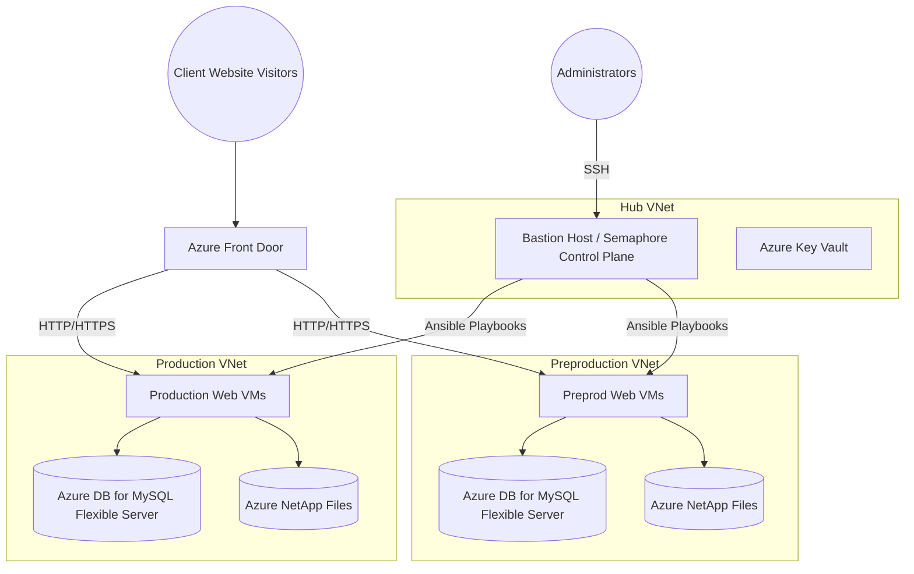

# 🏗️ Shared Hosting on Azure

> **Enterprise-grade LAMP stack hosting on Microsoft Azure.**

This repository provides an Infrastructure-as-Code (IaC) and Configuration Management solution designed to deploy and manage a secure, high-availability Shared Web Hosting platform.

## 🔗 Project Ecosystem Navigation

This project is part of a broader Azure automation suite:
* **Infrastructure Layer**: [azure-wp-stack-infrastructure](https://github.com/chinmaymjog/aks-cluster-setup) - AKS & Hub-Spoke Foundation.
* **Shared Hosting Layer** (You are here): Terraform & Ansible for high-density Web VMs.

---

## Architecture Overview



## 🏁 Phase 1: Infrastructure Deployment (Terraform)

The `deploy.sh` script automates the complex parts of the deployment: creating the remote state storage, generating SSH keys, and managing firewall rules.

### 1. Prerequisites
- **Terraform** (v1.3.x+)
- **Azure CLI** (v2.x)
- **Service Principal**: An SP with `Contributor` and `User Access Administrator` roles.
- **SSH Keys**: The script requires `webadmin_rsa` keys in `azure-lamp-hosting/terraform/`. If missing, `./deploy.sh` will **automatically generate them** for you.

### 2. Configure Credentials
Create a `.env` file in the root directory (git-ignored). This is used by `deploy.sh` for local execution.
```bash
export ARM_CLIENT_ID="<your-app-id>"
export ARM_CLIENT_SECRET="<your-password>"
export ARM_TENANT_ID="<your-tenant-id>"
export ARM_SUBSCRIPTION_ID="<your-subscription-id>"
```
*Note: If you are using GitHub Actions, configure these as Repository Secrets.*

### 3. Project Configuration
Customize your deployment settings in **`azure-lamp-hosting/terraform/terraform.tfvars`**:
- **`project`**: Your unique project name.
- **`location`**: The Azure region (defaults to `westeurope`).
- **⚠️ Scaling**: The default values are set to minimal tiers. See [Phase 3](#-phase-3-production-hardening--scaling) before deploying if you need production-grade specs.

### 4. Deploy Infrastructure
Run the following command to provision the base networking, VMs, and databases:
```bash
./deploy.sh apply
```

> [!TIP]
> **State Management**: On the first run, the script creates a dedicated Resource Group (`rg-tfstate-*`) and Storage Account to host your Terraform remote state. This ensures your deployment is stable and portable across team members.

### 5. Verify Deployment
Once Terraform finishes, it will output the **Bastion VM Public IP**. Keep this IP handy; you will need it for the next phase.

To verify basic connectivity:
```bash
# Replace with the IP from your Terraform output
ping <BASTION_PUBLIC_IP>
```

Proceed to **[Phase 2: Configuration Management](#️-phase-2-configuration-management-semaphore)** to deploy the software stack!

---

## ⚙️ Phase 2: Configuration Management (Semaphore)

Once Terraform finishes, Azure will output the public IP of the **Bastion VM**. 
The Bastion VM has automatically installed Docker and is ready to host **Ansible Semaphore** (Control Plane).

1. SSH into the Bastion VM using the private key generated by Terraform locally:
   ```bash
   ssh -i azure-lamp-hosting/terraform/webadmin_rsa webadmin@<BASTION_PUBLIC_IP>
   ```

2. Inside the Bastion host, download the setup files:
   ```bash
   mkdir -p semaphore && cd semaphore
   curl -O https://raw.githubusercontent.com/chinmaymjog/shared-hosting-azure/develop/ansible-control-plane/docker-compose.yml
   curl -O https://raw.githubusercontent.com/chinmaymjog/shared-hosting-azure/develop/ansible-control-plane/Dockerfile
   ```

3. Deploy the Semaphore stack:
   ```bash
   docker compose up -d
   ```

4. **Access Semaphore:**
   Open a browser and navigate to:
   `http://<BASTION_PUBLIC_IP>:3000`
   
   - **Username:** `admin`
   - **Password:** `Password123!`

### How to use Ansible Playbooks in Semaphore

After logging in, follow these steps to run your first playbook:

#### 1. Create a Project
Click on **New Project** and name it (e.g., "Azure Shared Hosting").

#### 2. Configure Key Store
Navigate to **Key Store** > **New Key**:
- **Name**: `BastionKey`
- **Type**: `SSH Key`
- **Login**: `webadmin`
- **Private Key**: Paste the contents of `azure-lamp-hosting/terraform/webadmin_rsa`.

#### 3. Configure Inventory
Navigate to **Inventory** > **New Inventory**:
- **Name**: `Azure Dynamic Inventory`
- **Type**: `File`
- **Path**: `/home/semaphore/vars/hosts`  *(This file is automatically generated and uploaded by Terraform)*.
- **Sudo Password**: (Leave blank, we use SSH keys).

#### 4. Configure Repository
Navigate to **Repositories** > **New Repository**:
- **Name**: `GitHub Repo`
- **URL**: `https://github.com/chinmaymjog/shared-hosting-azure.git`
- **Branch**: `main` (or `develop`)
- **Access Key**: Select `BastionKey`.

#### 5. Create Task Template
Navigate to **Task Templates** > **New Template**:
- **Name**: `Configure Web Servers`
- **Playbook File**: `ansible-control-plane/ansible/playbooks/server_web_configuration.yml`
- **Inventory**: Select `Azure Dynamic Inventory`.
- **Repository**: Select `GitHub Repo`.
- **Environment**: (Optional) You can create an environment to pass extra vars if needed.

#### 6. Run the Task
Click the **Run** button on your template. Semaphore will pull the latest code from GitHub and execute the playbook against your Azure VMs.

---

## 🚀 Phase 3: Production Hardening & Scaling

You can enable production features **before your first deployment** or **any time after** by updating `azure-lamp-hosting/terraform/terraform.tfvars`.

> [!NOTE]
> **Cost-Effective Testing Defaults:** The default configuration uses `Standard_B2ms` VMs and Burstable databases to minimize costs during evaluation.

For a true production-grade environment, follow the **[Production Hardening Guide](./documentation/4-Production-Hardening.md)**:

- **Compute Sizing**: Upgrade `web_vm_size` to `Standard_D4s_v5` and increase `web_instance_count` to at least 2 for High Availability.
- **Database Scaling**: Switch `db_sku_name` from `B_Standard_B1ms` to a General Purpose tier (e.g., `GP_Standard_D2ds_v4`) to support production workloads.
- **Security & WAF**: Enable **Azure Front Door Premium** with WAF policies (configured in the `frontdoor` module) to protect against common web attacks.
- **Storage Performance**: Use **Azure NetApp Files** (already included) but ensure you scale the capacity pool according to your storage throughput requirements.
- **Backups**: Ensure `backup_retention_days` is set to at least 7-30 days for both Database and VM snapshots.

---

## 🧹 Destruction (Teardown)

Since these Azure resources (specifically Front Door, NetApp Files, and Application Gateways) incur costs continuously, you should destroy the infrastructure when you are done testing.

Run:
```bash
./deploy.sh destroy
```

### 🏁 Phase 1: Infrastructure Deployment (GitHub Actions)
This repository includes a workflow in `.github/workflows/deploy.yml` to automatically test and deploy your Terraform code using **GitHub Actions**.

To use the workflow:
1.  **Fork this repository** to your own GitHub account.
2.  **Configure Secrets**: Add your Azure credentials as GitHub Repository Secrets:
    - `ARM_CLIENT_ID`
    - `ARM_CLIENT_SECRET`
    - `ARM_TENANT_ID`
    - `ARM_SUBSCRIPTION_ID`
3.  **Trigger**:
    - The workflow triggers a **`plan`** automatically on any push to `main` that affects terraform files.
    - You can manually trigger an **`apply`** or **`plan`** via the **Actions** tab using the `workflow_dispatch` event.

---
## Further Reading
For deeper customization details on the Terraform modules or resolving Azure deployment limits, please reference the [Documentation Directory](./documentation).
