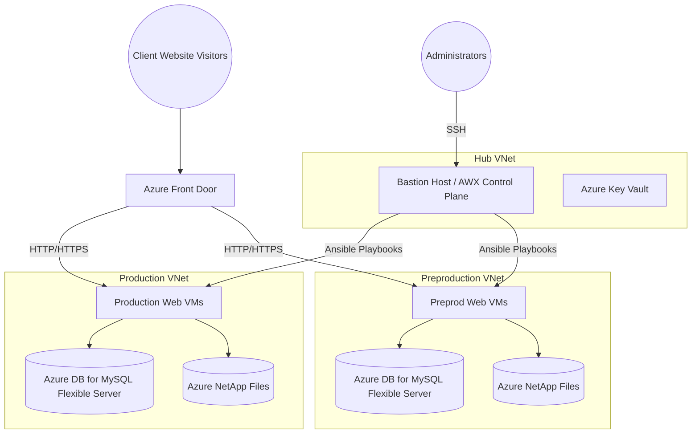

# Shared Hosting on Azure

This project is an Infrastructure-as-Code (IaC) and Configuration Management solution designed to deploy and manage a secure, high-availability Shared Web Hosting platform on Microsoft Azure.

It is split into two logical components:
1. **Infrastructure Provisioning (`azure-lamp-hosting/`)**: Uses **Terraform** to provision the networking, virtual machines, databases, object storage, and security layers.
2. **Configuration Management (`ansible-control-plane/`)**: Uses **AWX** (Ansible Tower) running on the Bastion VM to manage Apache, PHP, databases, certificates, and backups for the web servers.

## Architecture Overview



## Prerequisites

Before deploying the environment, ensure you have the following installed locally:
- [Terraform CLI](https://developer.hashicorp.com/terraform/downloads) (> v1.0.0)
- [Git](https://git-scm.com/downloads)
- An active Microsoft Azure Subscription.

You must also have an **Azure Service Principal** configured with the `Contributor` role scoped to your subscription. You need these four resulting values:
- `ARM_CLIENT_ID`
- `ARM_CLIENT_SECRET`
- `ARM_SUBSCRIPTION_ID`
- `ARM_TENANT_ID`

---

## Phase 1: Deploy Infrastructure (Terraform)

This project contains convenient shell scripts to streamline Terraform execution depending on where you are running it.

### Local Execution (Manual)
End-users cloning this repository should use the simplified `./deploy.sh` script. This executes standard `terraform init` and manages your **Terraform State File (`.terraform.tfstate`) locally** on your machine.

1. Clone this repository to your local machine:
   ```bash
   git clone git@gitlab.com:chinmaymjog1/shared-hosting-azure.git
   cd shared-hosting-azure
   ```
2. Create a `.env` file at the root of the project to inject your credentials:
   ```env
   ARM_CLIENT_ID="your-client-id"
   ARM_CLIENT_SECRET="your-client-secret"
   ARM_TENANT_ID="your-tenant-id"
   ARM_SUBSCRIPTION_ID="your-subscription-id"
   ```
3. (Optional) Review and edit `azure-lamp-hosting/terraform/terraform.tfvars` to customize VM sizes, regions, and environment codes. *Always leave standard configurations unless specifically overriding default behaviors.*
4. Deploy the infrastructure:
   ```bash
   ./deploy.sh apply
   ```

> ⚠️ **State Management Warning:** Because local execution strictly stores the Terraform state file on your hard drive, losing or deleting this `azure-lamp-hosting/terraform/` state file will result in Terraform forgetting it owns the Azure infrastructure. Running `./deploy.sh apply` again without the original state file will cause Azure to throw `Resource already exists` errors. Ensure you do not delete your local state folder while testing! If you encounter this error on discarded architecture, manually delete the Resource Groups in the Azure Portal to start fresh.

### Automated Execution (GitLab CI/CD - Maintainers Only)
> **Note:** The included `.gitlab-ci.yml` uses a dedicated `./deploy-ci.sh` script designed for automation. 

Unlike the local script, `deploy-ci.sh` dynamically detects the runner's IP to bypass Azure network firewalls, and automatically injects a **GitLab Managed HTTP Terraform Backend**. This means the CI pipeline securely centralizes the state file in the GitLab repository under *Operate > Terraform states*, guaranteeing the runner never accidentally loses track of the deployed infrastructure between jobs.

*Maintainers Required Variables:*
- `ARM_CLIENT_ID`, `ARM_CLIENT_SECRET`, `ARM_SUBSCRIPTION_ID`, `ARM_TENANT_ID` (Azure Credentials)
- `SSH_PRIVATE_KEY` and `SSH_PUBLIC_KEY` (The webadmin_rsa keys injected into the Bastion and authorized on the VMs).

---

## Phase 2: Configuration Management (AWX)

Once Terraform finishes, Azure will output the public IP of the **Bastion VM**. 
The Bastion VM has automatically installed Docker and is ready to host **AWX** (Ansible Control Plane).

1. SSH into the Bastion VM using the private key generated by Terraform locally (or found in Azure Key Vault if you skipped local execution):
   ```bash
   ssh -i azure-lamp-hosting/terraform/webadmin_rsa webadmin@<BASTION_PUBLIC_IP>
   ```

2. Inside the Bastion host, clone the repository and navigate to the Ansible Control Plane:
   ```bash
   git clone git@gitlab.com:chinmaymjog1/shared-hosting-azure.git
   cd shared-hosting-azure/ansible-control-plane
   ```

3. Deploy the AWX Docker Compose stack:
   ```bash
   make deploy
   ```

4. **Access AWX:**
   Wait 2-3 minutes for the database migrations to finish, then open a browser and navigate to exactly:
   `http://<BASTION_PUBLIC_IP>:8013`
   
   - **Username:** `admin`
   - **Password:** `Password123!`

From within AWX, you can configure your Git repository as a "Project" and run the provisioning playbooks (`server_hardening.yml`, site configuration, etc.) on your Web VMs.

---

## Destruction (Teardown)

Since these Azure resources (specifically Front Door, NetApp Files, and Application Gateways) incur costs continuously, you should destroy the infrastructure when you are done testing.

Run:
```bash
./deploy.sh destroy
```
*(Or use the manual trigger under pipelines in GitLab CI).*

---
## Further Reading
For deeper customization details on the Terraform modules or resolving Azure deployment limits, please reference the [Documentation Directory](./documentation).
