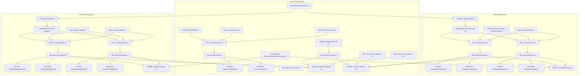

```mermaid
flowchart TD
    %% Resource Groups
    subgraph rg-host-prd-inc [RG: rg-host-prd-inc]
        VNetprd["VNet: vnet-host-prd-inc"]
        NSGprd["Network Security Group: nsg-host-prd-inc"]
        PIPprd["Public IP: pip-host-prd-inc"]
        LB_prd["Load Balancer: lb-host-prd-inc"]
        NICVM0_prd["NIC: nic-host-prd-inc-0"]
        VM0_prd["VM: web-host-prd-inc-0"]
        OSDiskVM0_prd["OS Disk: osdiskwebhostprdinc0"]
        DataDiskVM0_prd["Data Disk: diskwebhostprdinc0"]
        NICVM1_prd["NIC: nic-host-prd-inc-1"]
        VM1_prd["VM: web-host-prd-inc-1"]
        OSDiskVM1_prd["OS Disk: osdiskwebhostprdinc1"]
        DataDiskVM1_prd["Data Disk: diskwebhostprdinc1"]
        MySQLprd["MySQL: mysql-host-prd-inc"]
    end

    subgraph rg-host-hub-inc [RG: rg-host-hub-inc]
        VNetHub["VNet: vnet-host-hub-inc"]
        NSGHub["NSG: nsg-host-hub-inc"]
        PIPVMHub["PIP: pip-vm-host-hub-inc"]
        NICVMHub["NIC: nic-vm-host-hub-inc"]
        VMHub["VM: vm-host-hub-inc"]
        OSDiskVMHub["OS Disk: osdiskvmhosthubinc"]
        DataDiskVMHub["Data Disk: diskvmhosthubinc"]
        FD["Front Door: fd-host-hub-inc"]
        PrivateDNSzone["Private DNS: host.mysql.database.azure.com"]
        KV["Key Vault: kv-host-hub-inc"]
        NetApp["NetApp: netapp-host-hub-inc"]
        NetAppPool["Pool: pool-host-hub-inc"]
        NICVolumepprd["NIC: anf-vnet-host-pprd-inc-nic"]
        Volumepprd["Volume: volume-host-pprd-inc"]
        NICVolumeprd["NIC: anf-vnet-host-prd-inc-nic"]
        Volumeprd["Volume: volume-host-prd-inc"]
    end

    subgraph rg-host-pprd-inc [RG: rg-host-pprd-inc]
        VNetpprd["VNet: vnet-host-pprd-inc"]
        NSGpprd["NSG: nsg-host-pprd-inc"]
        PIPpprd["PIP: pip-host-pprd-inc"]
        LB_pprd["Load Balancer: lb-host-pprd-inc"]
        NICVM0_pprd["NIC: nic-host-pprd-inc-0"]
        VM0_pprd["VM: web-host-pprd-inc-0"]
        OSDiskVM0_pprd["OS Disk: osdiskwebhostpprdinc0"]
        DataDiskVM0_pprd["Data Disk: diskwebhostpprdinc0"]
        NICVM1_pprd["NIC: nic-host-pprd-inc-1"]
        VM1_pprd["VM: web-host-pprd-inc-1"]
        OSDiskVM1_pprd["OS Disk: osdiskwebhostpprdinc1"]
        DataDiskVM1_pprd["Data Disk: diskwebhostpprdinc1"]
        MySQLpprd["MySQL: mysql-host-pprd-inc"]
    end

    %% Relationships - Hub
    VNetHub --> NICVMHub
    NSGHub --> NICVMHub
    PIPVMHub --> NICVMHub
    NICVMHub --> VMHub
    VMHub --> OSDiskVMHub
    VMHub --> DataDiskVMHub
    PrivateDNSzone --> MySQLpprd
    PrivateDNSzone --> MySQLprd
    NetApp --> NetAppPool
    NetAppPool --> Volumepprd
    NetAppPool --> Volumeprd
    NICVolumepprd --> Volumepprd
    NICVolumeprd --> Volumeprd

    %% Preprod
    FD --> PIPpprd
    PIPpprd --> LB_pprd
    LB_pprd --> NICVM0_pprd
    LB_pprd --> NICVM1_pprd
    NICVM0_pprd --> VM0_pprd
    NICVM1_pprd --> VM1_pprd
    VM0_pprd --> OSDiskVM0_pprd
    VM1_pprd --> OSDiskVM1_pprd
    VM0_pprd --> DataDiskVM0_pprd
    VM1_pprd --> DataDiskVM1_pprd
    VM0_pprd --> Volumepprd
    VM1_pprd --> Volumepprd
    VM0_pprd --> MySQLpprd
    VM1_pprd --> MySQLpprd
    NSGpprd --> NICVM0_pprd
    NSGpprd --> NICVM1_pprd
    VNetpprd --> NICVM0_pprd
    VNetpprd --> NICVM1_pprd

    %% Prod
    FD --> PIPprd
    PIPprd --> LB_prd
    LB_prd --> NICVM0_prd
    LB_prd --> NICVM1_prd
    NICVM0_prd --> VM0_prd
    NICVM1_prd --> VM1_prd
    VM0_prd --> OSDiskVM0_prd
    VM1_prd --> OSDiskVM1_prd
    VM0_prd --> DataDiskVM0_prd
    VM1_prd --> DataDiskVM1_prd
    VM0_prd --> Volumeprd
    VM1_prd --> Volumeprd
    VM0_prd --> MySQLprd
    VM1_prd --> MySQLprd
    NSGprd --> NICVM0_prd
    NSGprd --> NICVM1_prd
    VNetprd --> NICVM0_prd
    VNetprd --> NICVM1_prd
```
